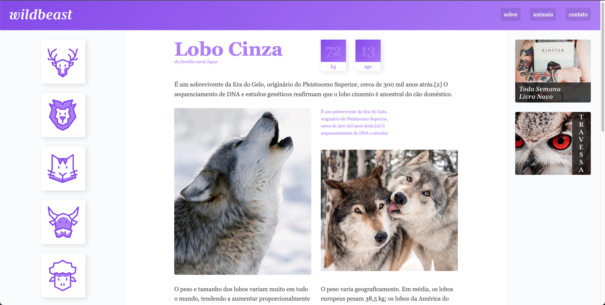

# Wildbeast
Projeto fictício e responsivo desenvolvido como parte do curso de Grid Layout da Origamid.

## Descrição

Wildbeast é um projeto fictício que foi criado com o objetivo de aplicar e consolidar os conceitos aprendidos no curso de Grid Layout da Origamid. O foco principal do projeto é a criação de um layout responsivo usando técnicas avançadas de Grid.

## Tecnologias Utilizadas

- HTML5
- CSS3 (com ênfase em Grid Layout)

## Pré-requisitos

- Navegador web moderno (recomendamos Chrome, Firefox, ou Safari)


## Veja o resultado online

[Acesse :)](https://viniciuzsk.github.io/wildbeast/)
 
## Como Baixar e Executar o Projeto

1. Clone o repositório para o seu ambiente local:
   ```bash
   git clone https://github.com/seu-usuario/wildbeast.git


